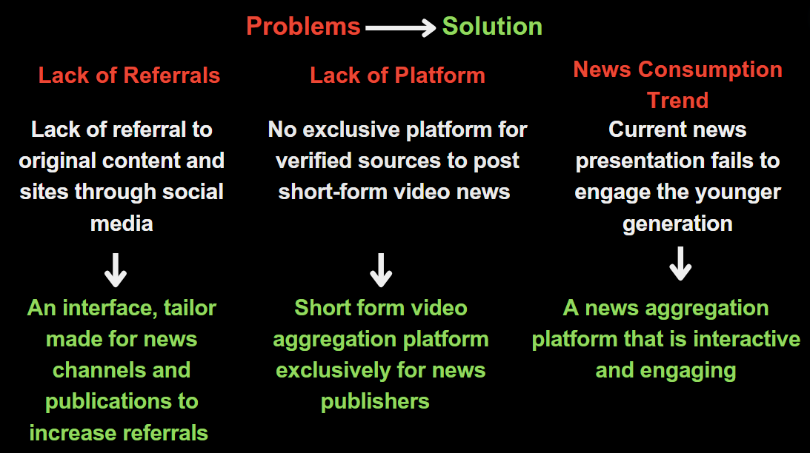
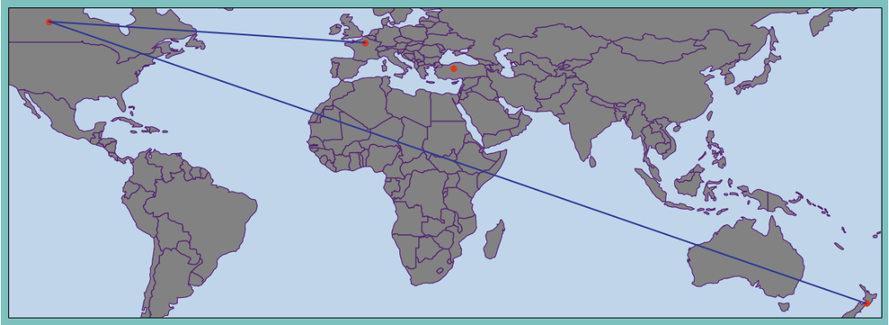
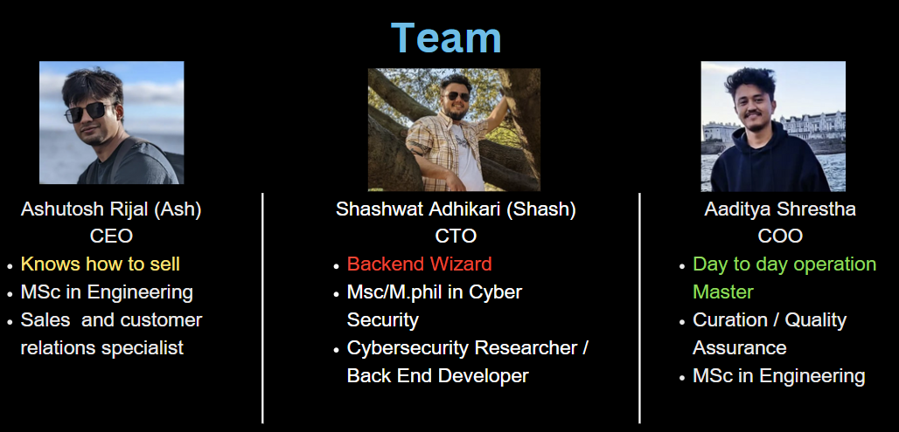

# InfoRush

## Executive Summary
 

  
## Dedicated News Platform

A source curated social platform designed exclusively for Publishers, News channels and Journalists; This platform allows these professionals to post social media-like updates and short-form video content without the need to compete with other niches. By creating a dedicated space for news-related content, it ensures that information remains relevant, focused, and accessible to those who seek it.

## Bridging the Engagement Gap with Young Audiences

Our platform aims to bridge the gap between critical world happenings and the ways in which young audiences engage with news content. By leveraging short-form video formats and interactive features, we make news more appealing, relatable, and accessible to younger generations. This approach not only keeps them informed but also encourages a deeper understanding and engagement with current events.

 

 

## We aim to create an interactive map that connects news articles based on geopolitical, financial, and other relevant links, enabling users to visualize and understand the global consequences of events and actions.

This proof-of-concept example (work in progress) demonstrates how our LLM identified connections between Canada, New Zealand, and France, where a trade dispute between Canada and New Zealand led to new possible negotiations between Canada and France.

 

## Our Founding Team

 

  

 

 

 

 

 

 


